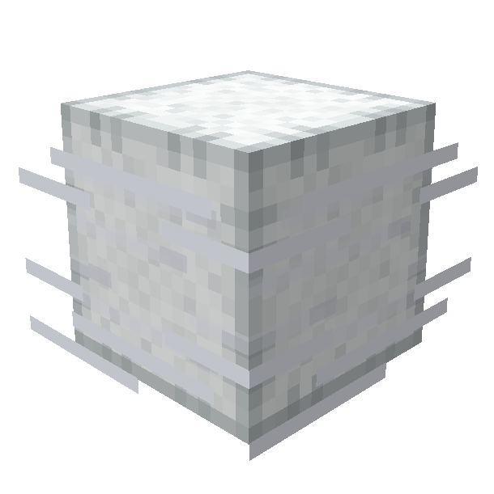
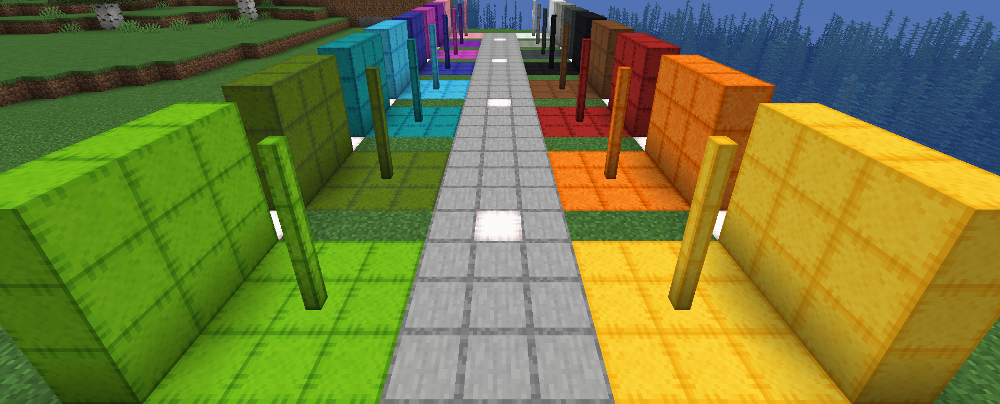

 

    

<h1 style="text-align: center;">Breeze Bounce </h1>

Bounce to new heights with Wind-Charged blocks! Inflate them for extra spring, or use them to 
create crazy obstacle courses.

## Current Features
***
### Bounce Block

This Wind Charge-infused, wool-like block bounces entities that touch any of its sides. 
It has an 'Inflated' state triggered by a wind charge strike, temporarily increasing its 
bounce power for a set duration.

- Recipe: 1x Wind Charge, 4x Leather, 4x Wool -> 4x Bounce Blocks
- Colours: White, Light Gray, Gray, Black, Brown, Red, Orange, Yellow, Lime, Green, 
  Cyan, Light Blue, Blue, Purple, Magenta, Pink

***Technical Info***
- When struck by a Wind Charge becomes inflated for 80 ticks
- Flammable and can be ignited by Lava
- Custom Sounds
  - When Player jumps
  - When Player bounces all sides
    - Pitch increase with greater velocity
  - Player Step
  - Inflate / Deflate

### Bounce Post Block

This block has similar properties to the Bounce Block but is the shape of a fence post.

- Recipe: 2x Bounce Blocks -> 8x Bounce Post Blocks
- Colours: White, Light Gray, Gray, Black, Brown, Red, Orange, Yellow, Lime, Green,
  Cyan, Light Blue, Blue, Purple, Magenta, Pink

***Technical Info***
- When struck by a Wind Charge becomes inflated for 80 ticks 
- Can be Waterlogged
- Flammable and can be ignited by Lava
- Custom Sounds
  - When Player jumps
  - When Player bounces all sides
    - Pitch increase with greater velocity
  - Player Step
  - Inflate / Deflate

### Supported Versions
***
Breeze Bounce supports [Fabric](https://fabricmc.net) and [NeoForge](https://neoforged.net) for Minecraft 1.21+.

Please submit bugs [here](https://github.com/ChefMooon/breeze-bounce/issues)

## Planned Features
***
*subject to change*

- Velcro Armour
  - Player can 'stick' to blocks when shifting

- Inflation Machine
  - Can keep blocks 'inflated' within a radius
  - Uses Wind Charges as 'fuel'

- Bounce Block Improvements
  - Double Bounce (almost working)
    - When a player falls more than 2.4 blocks and is shifting when they land, they block below and
      within 1 block will be 'inflated'
    - 2.4 blocks allows the player to double bounce on and only on the initial jump from
      a Bounce block
    - Similar to how you would double bounce your friends on a trampoline
  - More particle colours
  - Improve Collision Detection
    - I have ideas but no more brain power

- Bounce Post Block Improvements
  - Ability to place it horizontally
  - Improve collision shape

- More Bounce Block Variants
  - Slab, Stair, Wall

- Planned Config Options
  - Bounce Block
    - Ticks ‘inflated’
    - Base Bounce Power
    - Terminal Velocity
    - Double Jump Spread
    - Double Jump Activation Threshold

***Note:*** All planned features are subject to change. I wish they were complete for V1.0.0, but they
are outside my ability for now. I will implement them after Modfest with more time and learning!

***

***Known Bugs***
- Some Funky collisions in corners with AbstractBreezeBlocks
- When bouncing while sliding on ice you stop after a short time